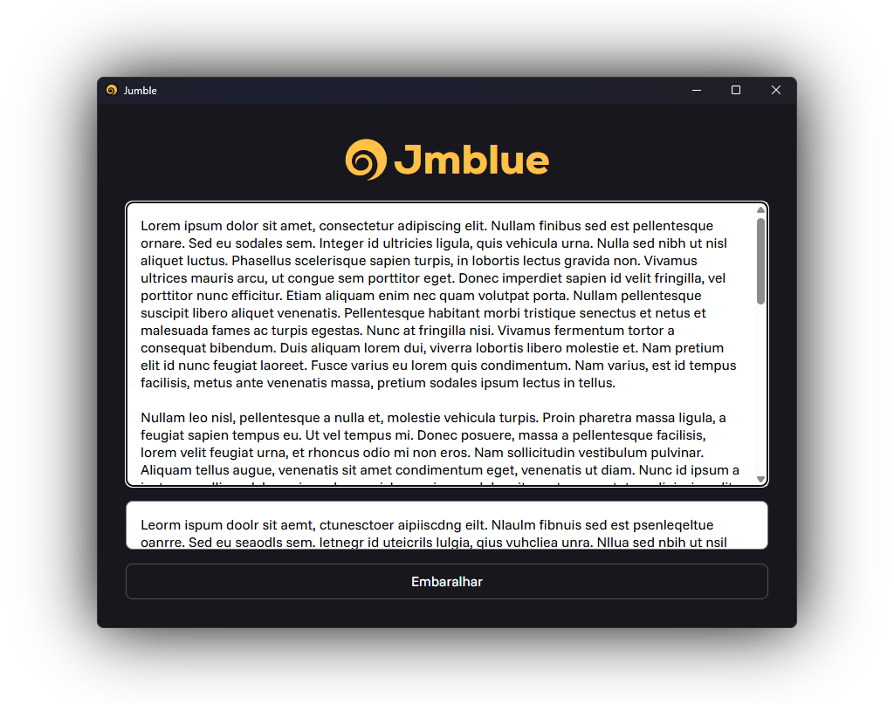

<div align="center">


</div>

**Jumble** is a simple application to jumble the characters in the words of a piece of text. This is based off of a scientific principle that determines that one can still read and understand a word as long as its first and last characters are where they should be.

My father is a teacher and wanted a tool to do this automatically, so I made this for him in the morning before he went to work. I figured I'd put it here in case anyone finds use in it.

<div align="center">



</div>

# Compilation

This project uses the Tauri framework and the Deno JavaScript runtime, so make sure to have installed the [Rust programming language](https://rust-lang.org/) and [Deno](https://deno.com/) beforehand.

Having done that, simply run these two commands at the project's root folder.

```Shell
deno install
deno task tauri dev
```

It should be able to run in any one of Tauri's supported platforms, including Windows, Linux and MacOS.

# License

This project is licensed under the Apache 2.0 license. Read more about it [here](https://choosealicense.com/licenses/apache-2.0/).

# Attributions

[swirl](https://thenounproject.com/icon/swirl-4040027/) by IronSV from [Noun Project](https://thenounproject.com/) (CC BY 3.0)